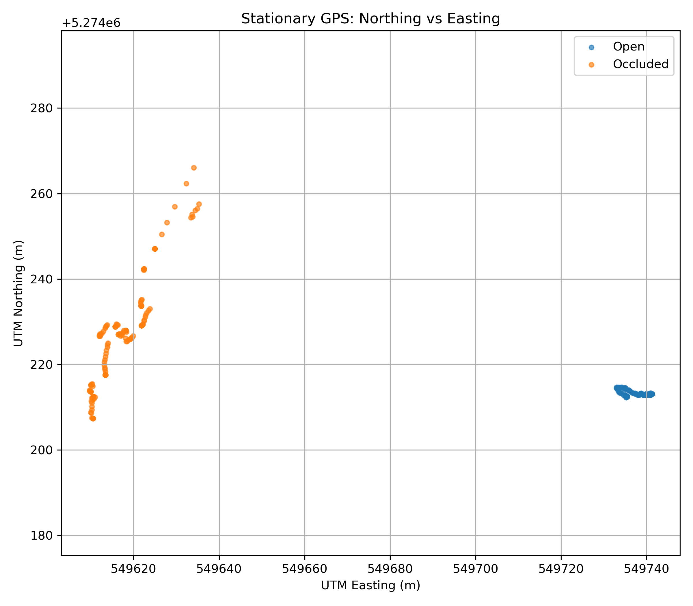
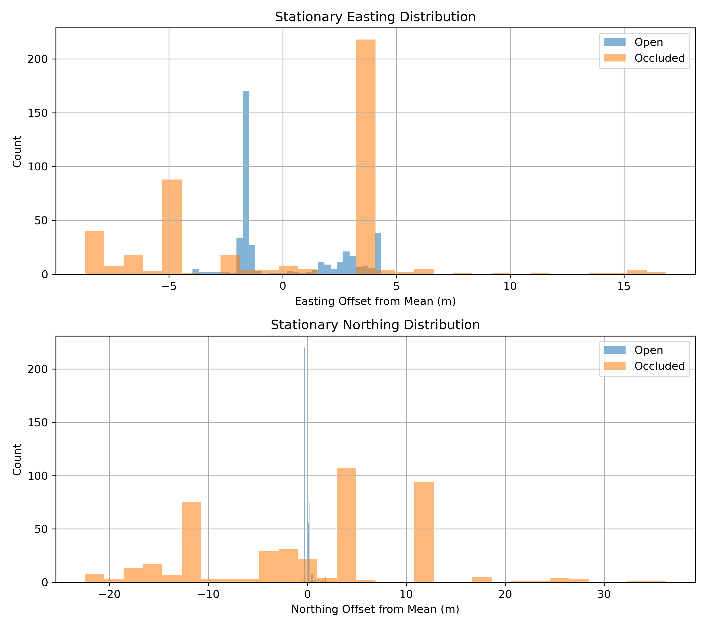
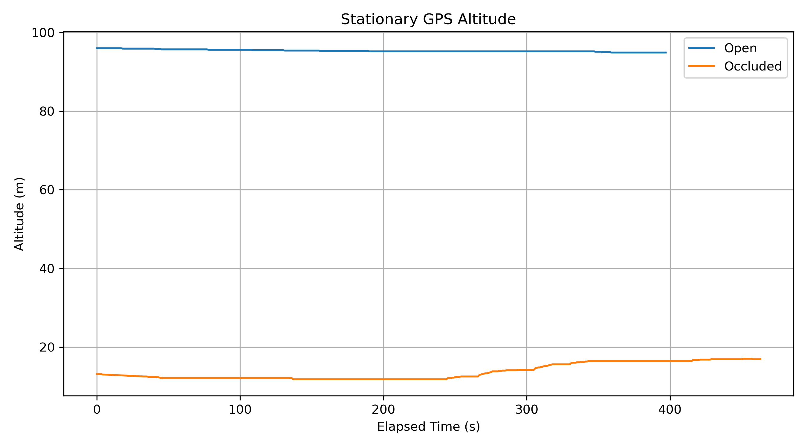
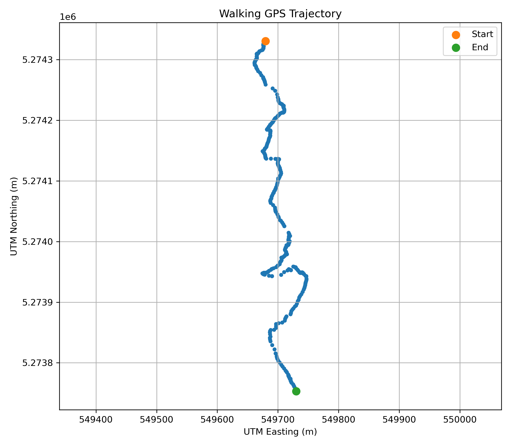
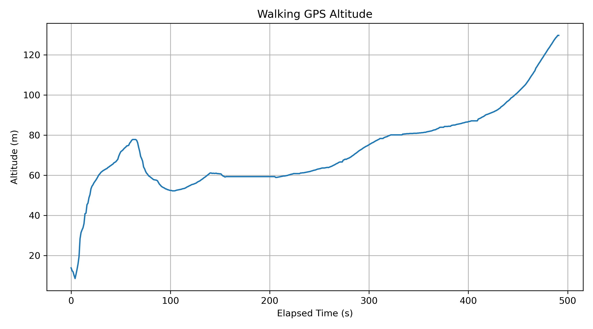

# EECE 5554 Lab 1: GNSS/GPS Report

**Name:** Zhiqi Zhang  
**Northeastern Username:** zhang.zhiqi2  
**Course:** EECE 5554 Robotics Sensing and Navigation  
**Lab:** Lab 1 – GNSS/GPS  

## 1. Objective

The goal of this lab was to build a ROS 2 GPS driver that reads NMEA data from a GPS receiver through USB serial, parses GPGGA messages, converts latitude and longitude into UTM coordinates, publishes the processed data using a custom ROS message, records ROS 2 bags, and analyzes the collected GNSS data.

## 2. ROS 2 GPS Driver

The driver reads GPS data from `/dev/ttyUSB0` at 4800 baud and parses `$GPGGA` sentences.

It publishes `gps_msgs/msg/Customgps` messages on:

```text
/gps
```

The custom message contains:

```text
std_msgs/Header header
float64 latitude
float64 longitude
float64 altitude
float64 utm_easting
float64 utm_northing
uint8 zone
string letter
float64 hdop
string gpgga_read
```

## 3. Verification

All emulator test vectors passed:

- Los Angeles: 12/12 PASS
- Boston: 12/12 PASS
- South: 12/12 PASS

The final self-check also passed:

```text
RESULT build=PASS
RESULT interface=PASS
RESULT launch_arg=PASS
RESULT vector_la=PASS
RESULT vector_boston=PASS
RESULT vector_south=PASS
RESULT bag_open=PASS
RESULT bag_occluded=PASS
RESULT bag_walking=PASS
RESULT gitignore=PASS
```

## 4. Data Collection

### Open Stationary

Location: Near Sushi Katsu-ya, Seattle, WA  
Reference location: `47.619412, -122.338042`

- Duration: 397.11 s
- Messages: 398

### Occluded Stationary

Location: Near HEYTEA (South Lake Union), Seattle, WA  
Reference location: `47.619897, -122.339460`

The GPS view of the sky was partially obstructed by nearby buildings.

- Duration: 463.13 s
- Messages: 437

### Walking

Start: Sellen Construction - Seattle, 227 Westlake Ave N  
Recorded start: `47.620472, -122.338850`

End: Starbucks Coffee Company, 2011 Westlake Ave  
Recorded end: `47.615273, -122.338240`

- Duration: 491.21 s
- Messages: 492
- Start-to-end displacement: approximately 579.57 m
- Accumulated GPS point-to-point path length: approximately 859.97 m

The accumulated GPS path length is larger because GNSS noise and sample-to-sample fluctuations accumulate when every point-to-point distance is summed.

## 5. Stationary Statistics

| Metric | Open Stationary | Occluded Stationary |
|---|---:|---:|
| Easting mean | 549736.907 m | 549618.410 m |
| Easting std. dev. | 2.354 m | 5.204 m |
| Northing mean | 5274212.778 m | 5274229.804 m |
| Northing std. dev. | 0.457 m | 11.023 m |
| Altitude mean | 95.359 m | 13.759 m |
| Altitude std. dev. | 0.294 m | 2.057 m |
| Mean HDOP | 1.313 | 1.711 |

The open dataset produced a much tighter position distribution than the occluded dataset. Under occlusion, the standard deviation increased substantially, especially in the Northing direction. The mean HDOP also increased from 1.313 to 1.711, which is consistent with poorer satellite geometry or signal quality.

## 6. Stationary Northing vs. Easting



The open dataset forms a compact cluster, while the occluded dataset shows a much larger spread and visible drift. This indicates that nearby buildings degraded the stability of the GNSS position solution.

## 7. Stationary Histograms



For the histograms, the mean Easting and Northing of each dataset were subtracted from the samples. This centers each dataset around zero so that the plots compare positional spread rather than the different physical locations where the measurements were collected.

The occluded distributions are wider and contain larger offsets, especially in Northing.

## 8. Stationary Altitude



The open stationary altitude remained relatively stable around 95 m, with a standard deviation of 0.294 m. The occluded altitude had a larger standard deviation of 2.057 m and changed gradually during the recording.

The large difference in absolute altitude between the two nearby collection locations suggests that the GNSS vertical solution was less reliable than the horizontal position solution under these conditions.

## 9. Walking Trajectory



The moving dataset forms a continuous trajectory between the recorded start and end locations. The route contains noticeable lateral deviations that may come from both the actual walking path and GNSS positioning noise.

The straight-line displacement between the first and last recorded points was approximately 579.57 m.

## 10. Walking Altitude



The walking altitude estimate changed substantially during the recording. The magnitude of the change is larger than would be expected from the physical route alone, suggesting significant vertical GNSS error and drift.

## 11. Issues Encountered

The workspace initially failed to rebuild with:

```bash
colcon build --symlink-install
```

I removed the generated `build`, `install`, and `log` directories and rebuilt the workspace from a clean state. After that, both `gps_msgs` and `gps_driver` built successfully.

The supplied verification script also initially failed to recognize valid Jazzy MCAP rosbag files because its bag check effectively required both `.mcap` and `.db3` files. I updated the check so that either format is accepted.

## 12. Conclusion

The ROS 2 GPS driver successfully read and parsed GPGGA data, converted latitude and longitude to UTM coordinates, published `Customgps` messages on `/gps`, and recorded real GNSS data.

The open stationary dataset showed lower positional variability and lower HDOP than the occluded dataset. The occluded measurements showed significantly greater horizontal scatter and altitude instability, demonstrating how environmental obstruction can reduce GNSS positioning quality.

The moving dataset produced a useful overall trajectory, but both horizontal position and especially altitude contained visible noise and drift.
