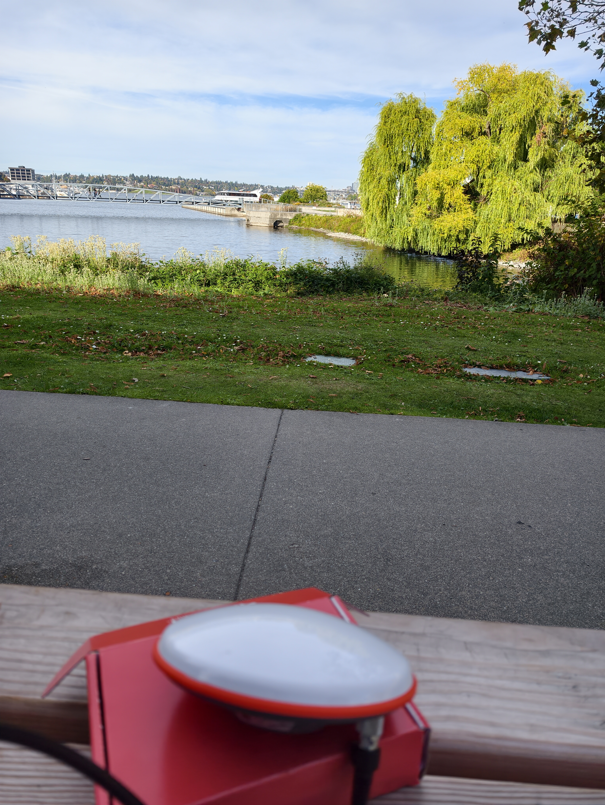
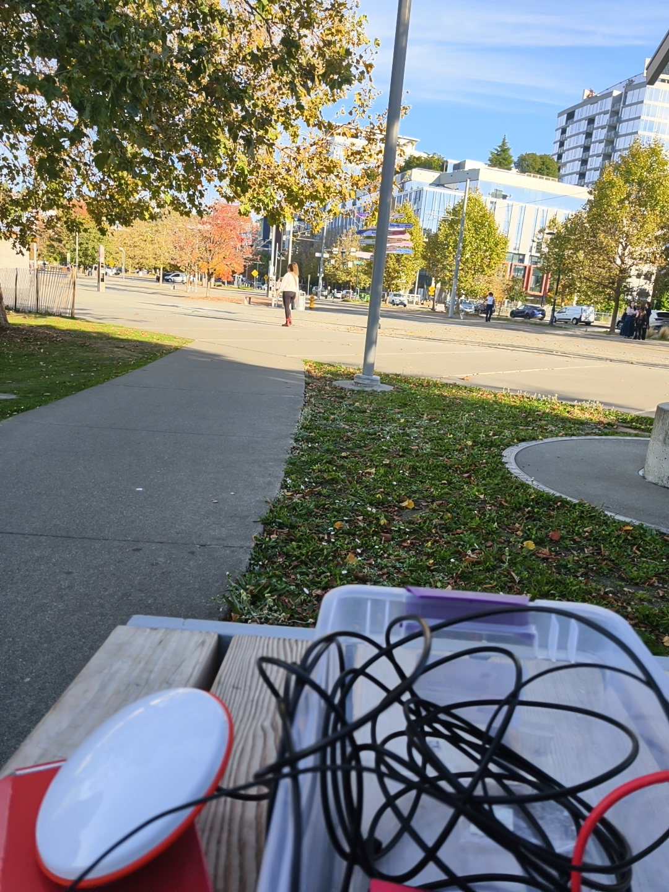
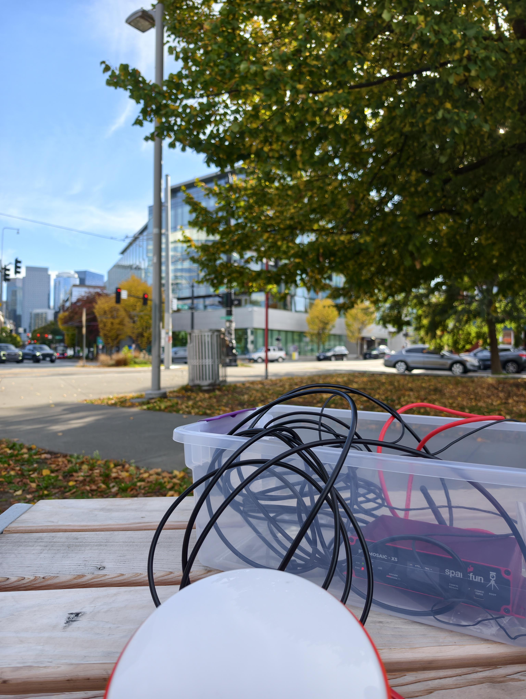
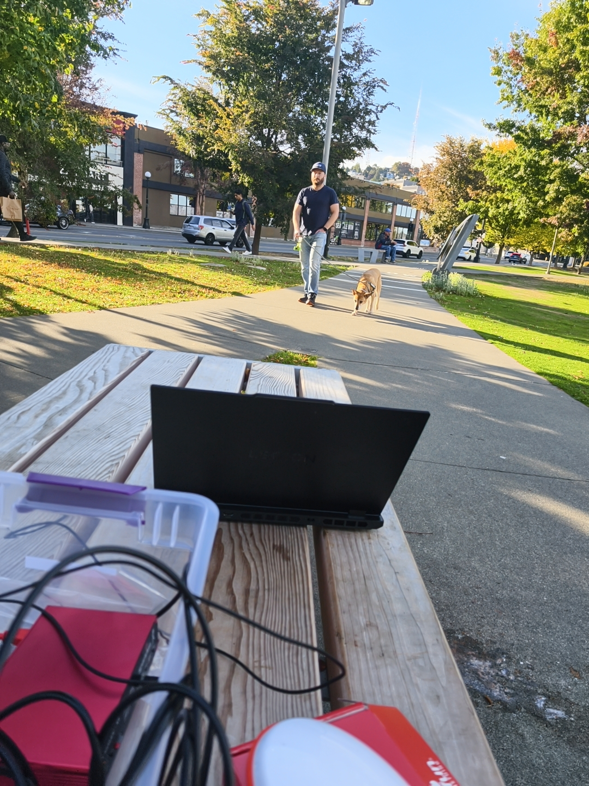
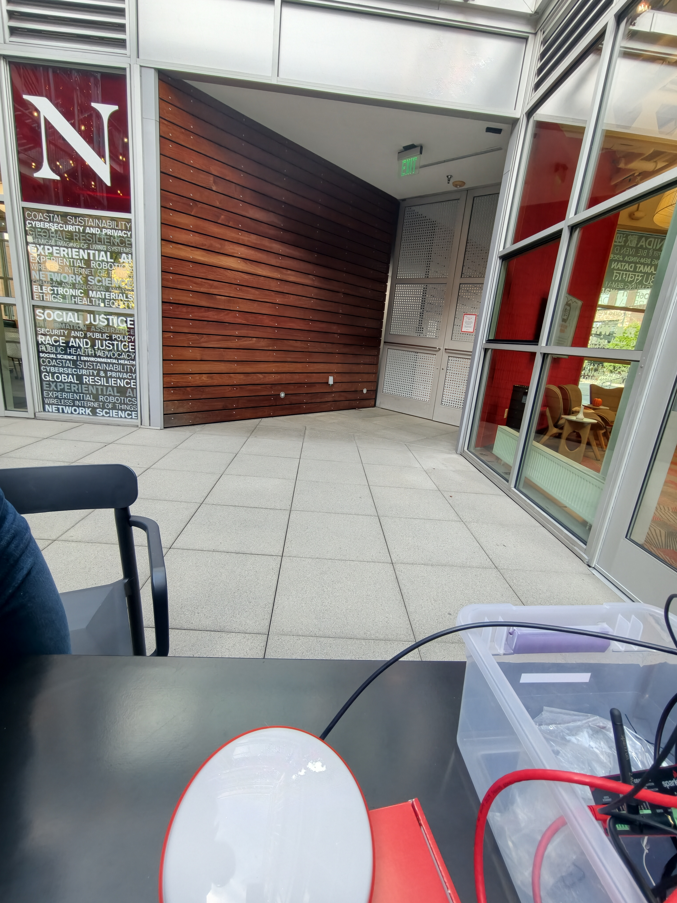
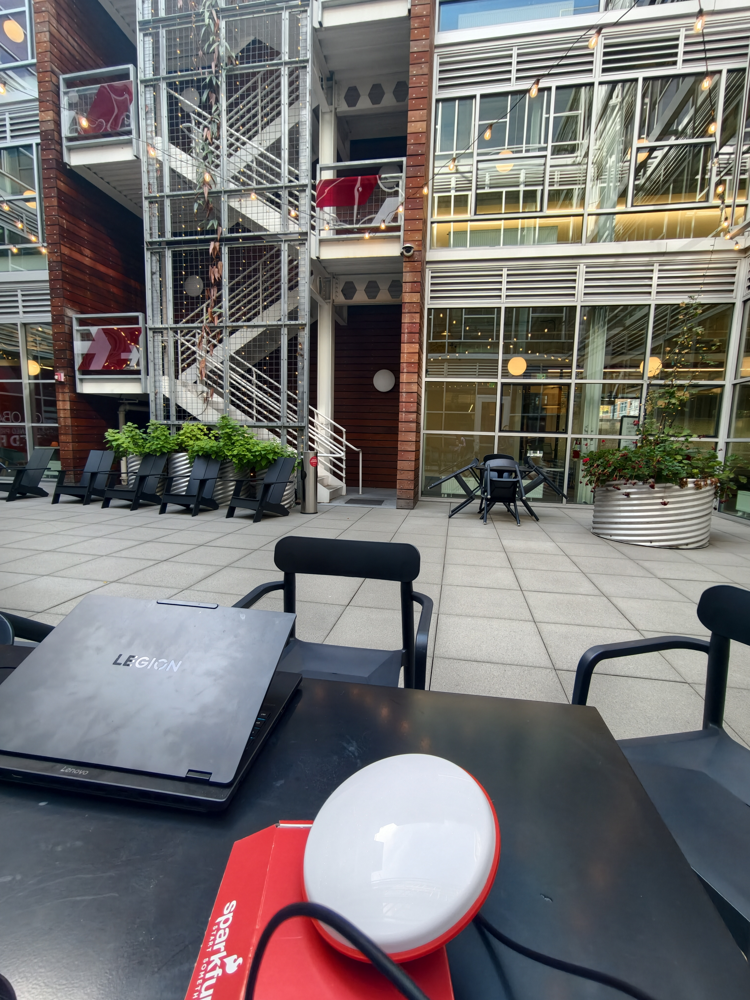
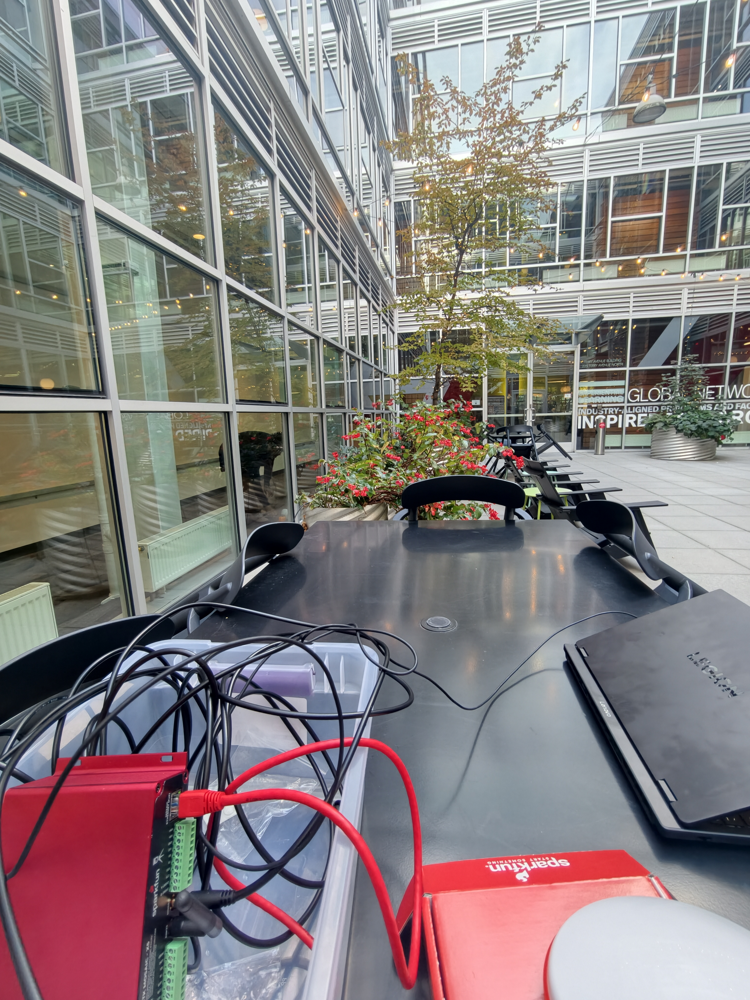
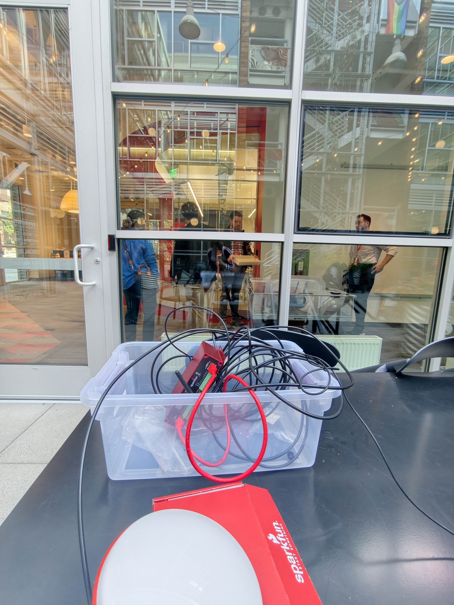

# ECE5554 — Lab 2: RTK GNSS

**Student:** Zhiqi Zhang (`zhang.zhiqi2`)\
**Repository URL:** [REPLACE WITH ACTUAL GITHUB REPOSITORY URL]\
**Course:** EECE5554 Robotics — Sensing and Navigation &#x20;

## Overview

This lab evaluates the precision of standalone GNSS and NTRIP-assisted RTK under open-sky and building-occluded conditions, with an additional walking trajectory. A Septentrio mosaic-X5 GNSS receiver provided NMEA GGA sentences, and a ROS 2 Jazzy `gps_driver` published the custom `gps_msgs/msg/Customrtk` message on `/gps`. The driver passed the supplied verification suite (22 checks passed, 0 failed); see `zhang.zhiqi2_lab2.txt`.

## Field log

Dates and approximate session times below are from field notes; GGA HHMMSS timestamps provide time-of-day but do **not** contain a calendar date. Approximate session times must not be confused with exact record-start times. Weather was sunny for all runs. The RTK mountpoint reported by the operator was `LFPWD_HV` (RTK2go). Corrections were off for standalone runs; `N/A` means not applicable.

| Run                 | Date (local) | Approx. session start (PDT) | Segment duration | Site                                                                                                 | Antenna height | Corrections / mountpoint | Mean satellites\* | Mean HDOP\*      | First float / fixed                      |
| ------------------- | ------------ | --------------------------- | ---------------- | ---------------------------------------------------------------------------------------------------- | -------------- | ------------------------ | ----------------- | ---------------- | ---------------------------------------- |
| open_standalone     | 2026-10-06   | \~3 PM (unverified)         | 600 s            | Open: 47.626083 N, -122.338472 W                                                                     | 0.6 m          | OFF / N/A                | 28.55             | 0.540            | N/A / N/A                                |
| open_rtk            | 2026-10-06   | \~3 PM (unverified)         | 600 s            | Same open site                                                                                       | 0.6 m          | ON / LFPWD_HV            | 18.29             | 0.708            | Not recorded / Not recorded              |
| occluded_standalone | 2026-10-06   | \~5 PM (unverified)         | 300 s            | 225 Terry Ave N, Seattle, WA 98109 (47.621813 N, -122.338262 W)                                      | 0.8 m          | OFF / N/A                | 11.47             | 1.249            | N/A / N/A                                |
| occluded_rtk        | 2026-10-06   | \~5 PM (unverified)         | 300 s            | Same occluded site                                                                                   | 0.8 m          | ON / LFPWD_HV            | 10.15             | 1.517            | Not recorded / No fixed epoch in segment |
| walking_rtk         | 2026-10-01   | \~6 PM (unverified)         | 200 s            | Walking route near 370 Westlake Ave N, Seattle, WA 98109; analyzed segment is a subset of full route | 1.5 m          | ON / LFPWD_HV            | See `epochs.csv`  | See `epochs.csv` | Not recorded / Not recorded              |

*Means are computed over valid-position epochs. Session clock estimates have not been independently reconciled with GGA UTC timing and must not be treated as precise timestamps. In particular, the open-session estimate may differ from the GGA-derived local clock time. The reported full walking route endpoint was 47.625694 N, -122.338361 W; it is not necessarily the endpoint of the analyzed 214.69 m segment.*

**Field observations.** The open run recorded all 601 RTK epochs as fixed. Occluded standalone had 32 no-fix epochs out of 301. Occluded RTK recorded no fixed epochs in the selected segment. The original walking file included extra motion and a later stationary interval; one continuous 201-epoch segment was selected for the stated analysis. The antenna was intended to remain stationary for paired runs; independent confirmation of exact repositioning is unavailable. Actual times from NTRIP activation to first float/fix were not logged and cannot be reliably reconstructed from trimmed files.

## Raw data, derived data, and ROS bags

- Original field-logged NMEA: `data/open.nmea`, `data/occluded.nmea`, `data/walking.nmea`.
- Five analysis segments: `data/open_standalone.nmea`, `data/open_rtk.nmea`, `data/occluded_standalone.nmea`, `data/occluded_rtk.nmea`, `data/walking_rtk.nmea`.
- Five **reconstructed** ROS 2 MCAP bags are in corresponding `data/<run>/` directories. **These bags were created after collection from field-logged NMEA; they were not recorded live on-site.** They should not be represented as originally captured bags. The NMEA-to-bag converter mirrors the driver message fields and uses the declared collection dates when composing ROS message timestamps.
- Bag message counts: open_standalone 602; open_rtk 601; occluded_standalone 269; occluded_rtk 301; walking_rtk 201. The 32 no-fix occluded standalone GGA records were not published into the reconstructed bag because the original driver requires valid latitude/longitude; they remain in the NMEA and fix-quality metrics.
- Analysis: `analysis/analyze_lab2.py` computes `analysis/results/stationary_metrics.csv`, `walking_metrics.csv`, and `epochs.csv`; `analysis/plot_lab2.py` produces six figures under `analysis/plots/`.
- This conversion preserves the recovered data for ROS tooling but may not satisfy the rubric's original field-recording requirement. The distinction is disclosed here for the grader.


## Site Photographs

Field photographs were collected at both the open-sky and occluded sites. At each site, four photographs were taken from the antenna position facing north, east, south, and west.

### Open-Sky Site

| North | East |
|---|---|
|  |  |

| South | West |
|---|---|
|  |  |

### Occluded Site

| North | East |
|---|---|
|  |  |

| South | West |
|---|---|
|  |  |

## Metrics table

| Metric                            | Open Standalone | Open RTK (all) | Open RTK (fixed only) | Occluded Standalone | Occluded RTK |
| --------------------------------- | --------------- | -------------- | --------------------- | ------------------- | ------------ |
| Epochs                            | 602             | 601            | 601                   | 301                 | 301          |
| Valid position epochs             | 602             | 601            | 601                   | 269                 | 301          |
| Median centroid deviation (m)     | 0.353           | 0.011          | 0.011                 | 24.273              | 5.977        |
| 95th percentile deviation (m)     | 0.602           | 0.019          | 0.019                 | 31.982              | 9.761        |
| Std easting (m)                   | 0.291           | 0.008          | 0.008                 | 21.310              | 5.401        |
| Std northing (m)                  | 0.231           | 0.010          | 0.010                 | 10.639              | 4.342        |
| 2DRMS (m)                         | 0.743           | 0.025          | 0.025                 | 47.636              | 13.860       |
| Std altitude (m)                  | 0.829           | 0.018          | 0.018                 | 48.708              | 10.134       |
| Quality 0 (%)                     | 0.00            | 0.00           | 0.00                  | 10.63               | 0.00         |
| Quality 1 (%)                     | 100.00          | 0.00           | 0.00                  | 89.37               | 5.65         |
| Quality 2 (%)                     | 0.00            | 0.00           | 0.00                  | 0.00                | 39.53        |
| Quality 4 (%)                     | 0.00            | 100.00         | 100.00                | 0.00                | 0.00         |
| Quality 5 (%)                     | 0.00            | 0.00           | 0.00                  | 0.00                | 54.82        |
| Mean satellites (valid positions) | 28.55           | 18.29          | 18.29                 | 11.47               | 10.15        |
| Mean HDOP (valid positions)       | 0.540           | 0.708          | 0.708                 | 1.249               | 1.517        |

**Methods.** For each stationary run, the centroid is the mean UTM easting/northing of valid position epochs. The median and 95th percentile distances are radial distances from that centroid. Population standard deviations (ddof=0) are used; 2DRMS = 2 × sqrt(std_easting² + std_northing²). Epochs with no valid horizontal position are excluded from position-based statistics, but all GGA epochs contribute to the fix-quality percentages. The reported satellite and HDOP means use valid-position epochs. Open RTK (all) and (fixed only) are identical because all 601 selected epochs have quality 4.

## Walking summary

| Metric                                       | Value                                               |
| -------------------------------------------- | --------------------------------------------------- |
| Epochs (valid)                               | 201 (201)                                           |
| Start-to-end displacement (m)                | 214.692                                             |
| Cumulative GNSS path (m)                     | 296.843                                             |
| Total least-squares perpendicular RMSE (m)   | 1.549                                               |
| Maximum absolute perpendicular deviation (m) | 9.161                                               |
| Fix quality 1 / 2 / 4 / 5                    | 4 (1.99%) / 37 (18.41%) / 80 (39.80%) / 80 (39.80%) |

The cumulative GNSS path is the sum of successive recorded position changes and is not an independent measurement of the actual walking distance. The line-fit RMSE includes both actual departures from a straight path and GNSS position errors.

## Analysis questions

### Q1. Which open-sky centroid is closer to the true antenna position?

The open standalone run has a median centroid deviation of 0.353 m and 2DRMS of 0.743 m, whereas open RTK has a median deviation of 0.011 m and 2DRMS of 0.025 m. Thus, the RTK measurements are approximately 29.9 times more tightly clustered in terms of 2DRMS. These statistics establish improved **precision**, not which centroid is closer to the true antenna location.

The UTM centroids are (549704.333 m E, 5274953.127 m N) for standalone and (549706.618 m E, 5274953.345 m N) for RTK, separated by approximately 2.296 m. Without a surveyed antenna position, we cannot determine which is less biased. Independent ground truth from a surveyed control point and a well-characterized antenna reference point/height would be necessary to evaluate absolute accuracy.

### Q2. What does a nearby reference station correct, and what changes at 200 km?

RTK positioning uses observations from a reference station to reduce errors shared between the base and rover, particularly satellite clock and orbit errors and spatially correlated ionospheric and tropospheric delays. Differencing is effective when the two receivers experience similar propagation conditions. However, it cannot eliminate receiver noise, local multipath, antenna-related errors, cycle slips, or atmospheric differences between the two locations.

The course identifies a primary reference station approximately 13 km away. During our field collection, we used the backup mountpoint `LFPWD_HV`, approximately 16.5 km away. Under open-sky conditions, our RTK-fixed measurements achieved a horizontal 2DRMS of 0.025 m, compared with 0.743 m for standalone GNSS. This demonstrates substantially tighter positioning precision with RTK in our experiment, although it does not establish absolute positioning accuracy.

At a hypothetical 200 km baseline, atmospheric conditions at the base and rover would be less correlated. Consequently, residual ionospheric and tropospheric errors would increase, making carrier-phase integer ambiguity resolution more difficult. We would expect longer convergence times, a lower probability of maintaining an RTK-fixed solution, and potentially increased position errors.

For a numerical illustration, consider a simplified horizontal RTK error model of **1 cm + 1 ppm of baseline length**, where 1 ppm corresponds to 1 mm per kilometer. This gives approximately **2.3 cm at 13 km**, **2.65 cm at 16.5 km**, and **21 cm at 200 km**. However, these values are conditional engineering estimates rather than measured errors or predictions of our receiver's performance. The model assumes favorable conditions and successful ambiguity resolution, which may not hold over a 200 km single-base connection. Actual performance could be substantially worse if the receiver remains in float or loses its RTK solution. Network RTK with atmospheric corrections or other long-baseline positioning methods would be more appropriate.

References: [USGS, *Techniques and Methods 11-D1*](https://pubs.usgs.gov/tm/11d1/tm11-D1.pdf) (illustrates baseline-dependent RTK error specifications); [Miao et al. (2026), *Ionospheric gradient modeling for fast ambiguity resolution in multi-GNSS RTK and NRTK*](https://link.springer.com/article/10.1186/s43020-026-00207-x) (long-baseline ambiguity-resolution limitations). The **1 cm + 1 ppm horizontal model** above is used as an illustrative assumption, not a specification measured for this device.

### Q3. How do float and fixed precision compare, and what is resolved?

Every epoch in the selected open RTK dataset is quality 4 (fixed): 601/601 samples. Its 2DRMS is 0.025 m, and the fixed-only subset consequently gives exactly the same value. **There are no float epochs in this open RTK segment**, so a within-run empirical float-versus-fixed precision comparison cannot be computed. The occluded RTK run has 54.82% float and 0% fixed, but its environment is different, so comparing it directly to open fixed would confound correction status with obstruction.

The float-to-fixed transition occurs when the carrier-phase integer-cycle ambiguities are resolved to integers with sufficient confidence. This can cause a discrete change in the position solution rather than just a gradual reduction in measurement noise. The original correction-on transition and time-to-first-fix are not recoverable from an open RTK segment that begins fixed; the first *observed* fixed epoch is not the true time-to-first-fix.

### Q4. Does RTK degrade proportionally more in the occluded environment?

Open-to-occluded 2DRMS increased from 0.743 m to 47.636 m for standalone (approximately 64.1×), versus 0.025 m to 13.860 m for RTK (approximately 557×). Therefore the RTK mode exhibits a larger proportional degradation relative to its exceptionally tight open-sky baseline. In absolute meters, standalone increased by approximately 46.893 m, compared with 13.835 m for RTK. The relative and absolute comparisons answer different questions and should not be conflated.

The occluded standalone run has 11.47 mean satellites and mean HDOP 1.249 (valid epochs), compared with 28.55 and 0.540 in open standalone. Occluded RTK has 10.15 mean satellites and HDOP 1.517, versus 18.29 and 0.708 in open RTK. Occluded RTK achieved 0% fixed; 54.82% of epochs were float, 39.53% differential, and 5.65% standalone. These results are consistent with poorer sky visibility, geometry, and possible multipath near a building; field photographs should be used to establish the actual obstruction pattern. 

### Q5. How does vertical precision compare with horizontal precision?

Using horizontal combined standard deviation H = sqrt(std_easting² + std_northing²), the ratio std_altitude/H is approximately 2.23 for open standalone, 1.42 for open RTK, 2.04 for occluded standalone, and 1.46 for occluded RTK. Thus the vertical component varies more than the combined horizontal component in all four stationary runs. In open sky, altitude standard deviation falls from 0.829 m (standalone) to 0.018 m (RTK); under obstruction it is 48.708 m and 10.134 m, respectively.

GNSS satellite geometry generally constrains horizontal position better than height because visible satellites occupy the sky above the receiver rather than surrounding it in all three dimensions. RTK reduces some correlated range/phase errors but cannot eliminate poor vertical geometry or local multipath. In these data, RTK also reduces the vertical-to-horizontal ratio, though this observation does not prove the ratio would behave the same way at every site.

### Q6. What does the walking run show compared with stationary RTK?

The selected walking segment has a 214.692 m start-to-end displacement and a total least-squares perpendicular RMSE of 1.549 m (maximum absolute perpendicular deviation 9.161 m). By comparison, stationary open RTK has a median centroid deviation of 0.011 m and 2DRMS of 0.025 m. This large difference must **not** be interpreted as a direct comparison of receiver accuracy: the walking metric is deviation from a fitted path and includes actual walking irregularity, while stationary 2DRMS measures scatter around a fixed centroid.

Walking fix quality is heterogeneous: 39.80% fixed, 39.80% float, 18.41% differential, and 1.99% standalone, compared with 100% fixed in open stationary RTK. Solution degradation plausibly contributes to the larger lateral scatter, but without an independently surveyed walking path or a second reference sensor we cannot separate GNSS error from the person's actual route deviation. Segment selection and receiver movement may also matter.

### Q7. Can this receiver alone guarantee 5 cm horizontal accuracy at 10 Hz on a mixed route?

No. The 0.025 m open-sky **2DRMS** shows tight stationary *precision* under all-fixed conditions, but it does not establish absolute horizontal **accuracy** within 5 cm, even in the open area. The occluded RTK run has 13.860 m 2DRMS and zero fixed epochs, indicating that corrections alone do not maintain centimeter-level consistency near the building. The walking segment has 1.549 m perpendicular line-fit RMSE and is fixed for only 39.80% of epochs. None of these results supports a continuous 5-cm accuracy guarantee on a mixed open/obstructed route.

Our logged GGA data are approximately 1 Hz; they do not demonstrate a 10 Hz GNSS positioning output or full robotics localization update rate. A robust robot would likely combine GNSS/RTK with an IMU, wheel odometry, and a fusion estimator (e.g., EKF), with visual or LiDAR odometry/SLAM where appropriate for the environment. Meeting the stated 5-cm accuracy requirement would still require ground-truth validation along the whole route and checks of update rate, latency, integrity, and outage handling.

## Reproducing the analysis

```
cd ~/EECE5554/Lab2
python3 analysis/analyze_lab2.py
python3 analysis/plot_lab2.py
source /opt/ros/jazzy/setup.bash
source ros2_ws/install/setup.bash
ros2 bag info data/open_rtk
```

Do not commit `ros2_ws/build/`, `ros2_ws/install/`, or `ros2_ws/log/`.
